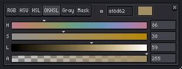
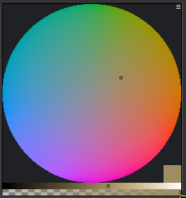
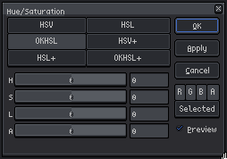

> [!NOTE]
> DISCLAIMER: the conversion parts were AI generated
# Features
- OkHsl color format

- OkHsl color wheel

- OkHsl support for the Hue/Saturation filter

# Examples
side-by-side comparison of desaturation using the Hue/Saturation filter:
#### Original

#### Desaturated by HSL

#### Desaturated by OkHsl

credit: [Terra x2 by Vagrant](https://pixeljoint.com/pixelart/139311.htm)
